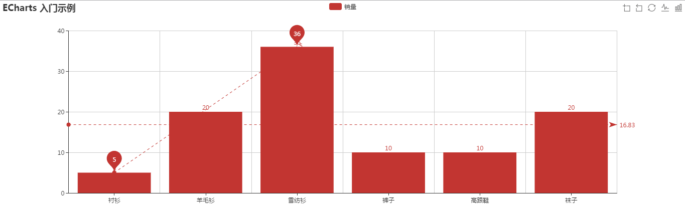
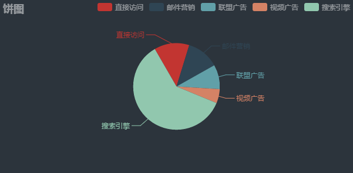
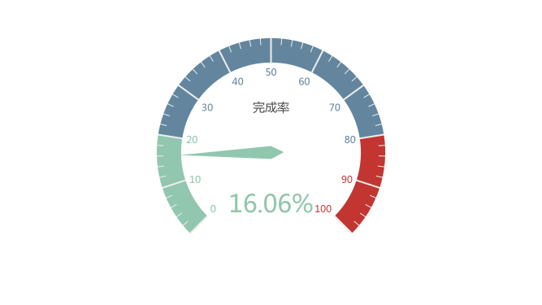

Tags: echarts
# echarts demo 学习记录

# 引入 ECharts
ECharts 3 开始不再强制使用 AMD 的方式按需引入，代码里也不再内置 AMD 加载器。因此引入方式简单了很多，只需要像普通的 JavaScript 库一样用 script 标签引入。
```
<!DOCTYPE html>
<html>
<header>
    <meta charset="utf-8">
    <!-- 引入 ECharts 文件 -->
    <script src="echarts.min.js"></script>
</header>
</html>
```

# demo01 柱状图的简单实现
基于准备好的dom，初始化echarts实例
`var myChart = echarts.init(document.getElementById('dom'));`
使用刚指定的配置项和数据显示图表。
`myChart.setOption(option);`
```
<!DOCTYPE html>
<html lang="en">
<head>
	<meta charset="UTF-8">
	<meta name="viewport" content="width=device-width, initial-scale=1,user-scalable=no"/>
	<title>Document</title>
	<script src="../dist/echarts.min.js"></script>
</head>
<body>
<!-- 为 ECharts 准备一个具备大小（宽高）的 DOM -->
<div id="main" style="width: 600px;height:400px;"></div>
<script type="text/javascript">
	// 基于准备好的dom，初始化echarts实例
	var myChart = echarts.init(document.getElementById('main'));
	// 指定图表的配置项和数据
	var option = {
		title: {
			text: 'ECharts 入门示例'
		},
		tooltip: {},
		legend: {
			data: ['销量']
		},
		xAxis: {
			data: ["衬衫", "羊毛衫", "雪纺衫", "裤子", "高跟鞋", "袜子"]
		},
		yAxis: {},
		series: [{
			name: '销量',
			type: 'bar',
			data: [5, 20, 36, 10, 10, 20]
		}]
	};
	// 使用刚指定的配置项和数据显示图表。
	myChart.setOption(option);
</script>
</body>
</html>
```
# demo02 折线图width toolbox 保存图片
 - 设置标题 `title.text`
 - 提示器 `tooltop.trigger`
 - 工具盒 `toolbox` 可以修改工具盒样式等，保存图片的样式等
 - 绘制区域间距 `grid`
  - `grid.containLabel`: false // 坐标轴刻度是否包含在间距内,true：不包含,false：包含
  - `grid.left`,`grid.top`,`grid.bottom`,`grid.right`
 - x轴 `xAxis`
  - `xAxis.boundaryGap` 坐标轴两边留白策略，类目轴和非类目轴的设置和表现不一样。 true：留白;false：不留白（顶在最前面）
  - `xAxis.splitLine` 分割线
 - 系列列表
 
```javascript
option = {
	title: {
		text: '堆叠区域图'
	},
	tooltip: {
		trigger: 'axis'
	},
	legend: {
		data: ['邮件营销', '联盟广告', '视频广告', '直接访问', '搜索引擎']
	},
	toolbox: {
		feature: {
			saveAsImage: {
				show: true,
				name: "saveimg", // 点击保存图片默认名字
				type: "png", // 保存图片类型
				backgroundColor: "#f30",// 保存图片后的背景图（之前是png透明色或者jpg的白色）
				excludeComponents: true, // 保存为图片时忽略的组件列表，默认忽略工具栏。
				title: "click to save the img" // 图标文字提示
			}
		}
	},
	grid: {
		top: 50,
		left: 50,
		bottom: 50,
		right: 50,
		containLabel: false
	},
	xAxis: [
		{
			type: 'category',
			boundaryGap: false,
			splitLine: {show: true},
			data: ['周一', '周二', '周三', '周四', '周五', '周六', '周日']
		}
	],
	yAxis: {},
	series: [
		{
			name: '邮件营销',
			type: 'line',
			stack: '总量', // 加上堆叠式显示
			areaStyle: {normal: {}}, // 面积型展示
			data: [120, 132, 101, 134, 90, 230, 210]
		},
		{
			name: '联盟广告',
			type: 'line',
			stack: '总量',
			areaStyle: {normal: {}},
			data: [220, 182, 191, 234, 290, 330, 310]
		},
		{
			name: '视频广告',
			type: 'line',
			stack: '总量',
			areaStyle: {normal: {}},
			data: [150, 232, 201, 154, 190, 330, 410]
		},
		{
			name: '直接访问',
			type: 'line',
			stack: '总量',
			areaStyle: {normal: {}},
			data: [320, 332, 301, 334, 390, 330, 320]
		},
		{
			name: '搜索引擎',
			type: 'line',
			stack: '总量',
			label: {
				normal: {
					show: true,
					position: 'top'
				}
			},
			areaStyle: {normal: {}},
			data: [820, 932, 901, 934, 1290, 1330, 1320]
		}
	]
};
```

# demo03 柱状图
 - `xAxis.axisTick` 坐标轴刻度相关设置。 
  - `xAxis.axisTick.alignWithLabel` 类目轴中在 boundaryGap 为 true 的时候有效，可以保证刻度线和标签对齐。所以是共同设置为true，这样刻度尺就会在bar中间
 - `tooltip.axisPointer` 坐标轴指示器配置项，在 trigger 为 'axis' 时有效。
  - `tooltip.axisPointer.type` 指示器类型。
   - `tooltip.axisPointer.type.line` 直线指示器
   - `tooltip.axisPointer.type.cross` 十字准星指示器
   - `tooltip.axisPointer.type.shadow` 阴影指示器

```html
<!DOCTYPE html>
<html lang="en">
<head>
	<meta charset="UTF-8">
	<meta name="viewport" content="width=device-width, initial-scale=1,user-scalable=no"/>
	<title>Document</title>
	<script src="../assets/echarts.min.js"></script>
	<style>
		* {
			margin: 0;
			padding: 0;
		}
	</style>
</head>
<body>
<div id="container"></div>
<script type="text/javascript">
	var w = document.documentElement.clientWidth,
			h = document.documentElement.clientHeight,
			ctner = document.getElementById("container");
	ctner.style.cssText = "width:" + w + "px;height:" + h + "px;";

	var myChart = echarts.init(ctner);

	option = {
		tooltip : {
			trigger: 'axis',
			axisPointer : {            // 坐标轴指示器，坐标轴触发有效
				type : 'shadow'        // 默认为直线，可选为：'line' | 'shadow'
			}
		},
		legend: {
			data:['直接访问','邮件营销','联盟广告','视频广告','搜索引擎','百度','谷歌','必应','其他']
		},
		grid: {
			left: '3%',
			right: '4%',
			bottom: '3%',
			containLabel: true
		},
		xAxis : [
			{
				type : 'category',
				boundaryGap: true,
				axisTick: {
					alignWithLabel: true
				},
				data : ['周一','周二','周三','周四','周五','周六','周日']
			}
		],
		yAxis : {},
		series : [
			{
				name:'直接访问',
				type:'bar',
				data:[320, 332, 301, 334, 390, 330, 320]
			},
			{
				name:'邮件营销',
				type:'bar',
				stack: '广告',
				data:[120, 132, 101, 134, 90, 230, 210]
			},
			{
				name:'联盟广告',
				type:'bar',
				stack: '广告',
				data:[220, 182, 191, 234, 290, 330, 310]
			},
			{
				name:'视频广告',
				type:'bar',
				stack: '广告',
				data:[150, 232, 201, 154, 190, 330, 410]
			},
			{
				name:'搜索引擎',
				type:'bar',
				data:[862, 1018, 964, 1026, 1679, 1600, 1570],
				markLine : {
					lineStyle: {
						normal: {
							type: 'dashed'
						}
					},
					data : [
						[{type : 'min'}, {type : 'max'}]
					]
				}
			},
			{
				name:'百度',
				type:'bar',
				barWidth : 5,
				stack: '搜索引擎',
				data:[620, 732, 701, 734, 1090, 1130, 1120]
			},
			{
				name:'谷歌',
				type:'bar',
				stack: '搜索引擎',
				data:[120, 132, 101, 134, 290, 230, 220]
			},
			{
				name:'必应',
				type:'bar',
				stack: '搜索引擎',
				data:[60, 72, 71, 74, 190, 130, 110]
			},
			{
				name:'其他',
				type:'bar',
				stack: '搜索引擎',
				data:[62, 82, 91, 84, 109, 110, 120]
			}
		]
	};


	myChart.setOption(option);

</script>
</body>
</html>
```

# demo04 柱状图折线图切换
 - X轴垂直辅助线
 - 数据缩放
 - 视图重置
 - 视图图例切换
 - 标记线（平均线，最小值到最大值线）
 - 标记点（最大值、最小值）

```javascript
toolbox: {
	show: true, // 工具箱展示
	feature: {
		dataZoom: { // 数据缩放
			show: true
		},
		restore: { // 操作重置
			show: true
		},
		magicType: {
			type: ["line", "bar"] // 柱状图与折线图切换
		}
	}
},
```

```
xAxis: {
	boundaryGap: true, // 直方图与两边有见习
	axisTick: { // 刻度对齐直方图中间
		alignWithLabel: true
	},
	splitLine: { // x轴辅助线
		show: true
	},
	data: ["衬衫", "羊毛衫", "雪纺衫", "裤子", "高跟鞋", "袜子"]
},
```

```
series: [{
	name: '销量',
	type: 'bar',
	data: [5, 20, 36, 10, 10, 20],
	label: {
		normal: {
			show: true,
			position: 'top'
		}
	},
	markPoint: { // 标记点
		data: [
			{type: "max", name: "最大值"}, // 会标记出来最大值
			{type: "min", name: "最小值"}, // 会标记出来最小值
		]
	},
	markLine: { // 标记线
		data: [
			{type: "average", name: "平均值"} // 会画出一条平均线,
			[{type: 'min', name: "最小值"}, {type: 'max', name: "最大值"}] // 会画出一条从最小值到最大值的线段
		]
	}
}]
```


# demo05 饼图
用于直观展示数据占比。

 - `legend.orient` 可选：'horizontal' // 水平排列 | 'vertical' // 垂直排列
 - [series[i]-pie.radius](http://echarts.baidu.com/option.html#series-pie.radius) [ default: [0, '75%']]饼图的半径，数组的第一项是内半径，第二项是外半径。支持设置成百分比，相对于容器高宽中较小的一项的一半。可以将内半径设大显示成圆环图（Donut chart）。
 - `series-pie.center` 饼图的中心（圆心）坐标，数组的第一项是横坐标，第二项是纵坐标。支持设置成百分比，设置成百分比时第一项是相对于容器宽度，第二项是相对于容器高度。
 - `series.selectedMode` 是否多选
 - `series.startAngle` 起始角度，支持范围[0, 360]。
 - `series.animationDuration` 处世动画执行时间 3000ms


# demo06 仪表图
用于展示数据在某一区间具体的位置。
模拟运动的仪表盘。
code: 简单的实现方式。
```javascript 
var option = {
	tooltip: {
		formatter: "{a} <br/>{b} : {c}%"
	},
	series: [{
		name: "业务指标",
		type: "gauge",
		detail: {formatter: "{value}%"},
		data: [{value: 32, name: "完成率"}]
	}]
};
```
