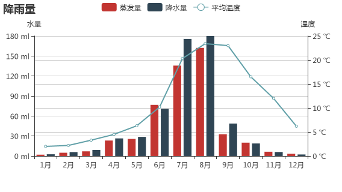
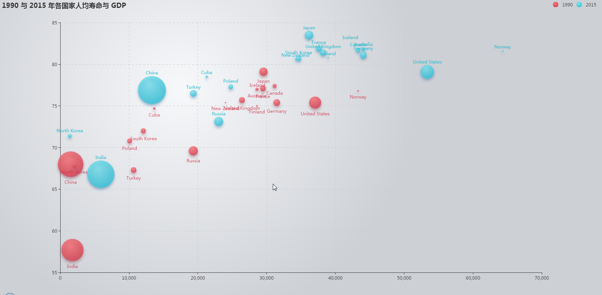

Tags: echarts
# echarts demo 学习记录

# 引入 ECharts
ECharts 3 开始不再强制使用 AMD 的方式按需引入，代码里也不再内置 AMD 加载器。因此引入方式简单了很多，只需要像普通的 JavaScript 库一样用 script 标签引入。
```
<!DOCTYPE html>
<html>
<header>
    <meta charset="utf-8">
    <!-- 引入 ECharts 文件 -->
    <script src="echarts.min.js"></script>
</header>
</html>
```

# demo01 柱状图的简单实现
基于准备好的dom，初始化echarts实例
`var myChart = echarts.init(document.getElementById('dom'));`
使用刚指定的配置项和数据显示图表。
`myChart.setOption(option);`
```
<!DOCTYPE html>
<html lang="en">
<head>
	<meta charset="UTF-8">
	<meta name="viewport" content="width=device-width, initial-scale=1,user-scalable=no"/>
	<title>Document</title>
	<script src="../dist/echarts.min.js"></script>
</head>
<body>
<!-- 为 ECharts 准备一个具备大小（宽高）的 DOM -->
<div id="main" style="width: 600px;height:400px;"></div>
<script type="text/javascript">
	// 基于准备好的dom，初始化echarts实例
	var myChart = echarts.init(document.getElementById('main'));
	// 指定图表的配置项和数据
	var option = {
		title: {
			text: 'ECharts 入门示例'
		},
		tooltip: {},
		legend: {
			data: ['销量']
		},
		xAxis: {
			data: ["衬衫", "羊毛衫", "雪纺衫", "裤子", "高跟鞋", "袜子"]
		},
		yAxis: {},
		series: [{
			name: '销量',
			type: 'bar',
			data: [5, 20, 36, 10, 10, 20]
		}]
	};
	// 使用刚指定的配置项和数据显示图表。
	myChart.setOption(option);
</script>
</body>
</html>
```
# demo02 折线图toolbox 保存图片
 - 设置标题 `title.text`
 - 提示器 `tooltop.trigger`
 - 工具盒 `toolbox` 可以修改工具盒样式等，保存图片的样式等
 - 绘制区域间距 `grid`
  - `grid.containLabel`: false // 坐标轴刻度是否包含在间距内,true：不包含,false：包含
  - `grid.left`,`grid.top`,`grid.bottom`,`grid.right`
 - x轴 `xAxis`
  - `xAxis.boundaryGap` 坐标轴两边留白策略，类目轴和非类目轴的设置和表现不一样。 true：留白;false：不留白（顶在最前面）
  - `xAxis.splitLine` 分割线
 - 系列列表
 
```javascript
option = {
	title: {
		text: '堆叠区域图'
	},
	tooltip: {
		trigger: 'axis'
	},
	legend: {
		data: ['邮件营销', '联盟广告', '视频广告', '直接访问', '搜索引擎']
	},
	toolbox: {
		feature: {
			saveAsImage: {
				show: true,
				name: "saveimg", // 点击保存图片默认名字
				type: "png", // 保存图片类型
				backgroundColor: "#f30",// 保存图片后的背景图（之前是png透明色或者jpg的白色）
				excludeComponents: true, // 保存为图片时忽略的组件列表，默认忽略工具栏。
				title: "click to save the img" // 图标文字提示
			}
		}
	},
	grid: {
		top: 50,
		left: 50,
		bottom: 50,
		right: 50,
		containLabel: false
	},
	xAxis: [
		{
			type: 'category',
			boundaryGap: false,
			splitLine: {show: true},
			data: ['周一', '周二', '周三', '周四', '周五', '周六', '周日']
		}
	],
	yAxis: {},
	series: [
		{
			name: '邮件营销',
			type: 'line',
			stack: '总量', // 加上堆叠式显示
			areaStyle: {normal: {}}, // 面积型展示
			data: [120, 132, 101, 134, 90, 230, 210]
		},
		{
			name: '联盟广告',
			type: 'line',
			stack: '总量',
			areaStyle: {normal: {}},
			data: [220, 182, 191, 234, 290, 330, 310]
		},
		{
			name: '视频广告',
			type: 'line',
			stack: '总量',
			areaStyle: {normal: {}},
			data: [150, 232, 201, 154, 190, 330, 410]
		},
		{
			name: '直接访问',
			type: 'line',
			stack: '总量',
			areaStyle: {normal: {}},
			data: [320, 332, 301, 334, 390, 330, 320]
		},
		{
			name: '搜索引擎',
			type: 'line',
			stack: '总量',
			label: {
				normal: {
					show: true,
					position: 'top'
				}
			},
			areaStyle: {normal: {}},
			data: [820, 932, 901, 934, 1290, 1330, 1320]
		}
	]
};
```

# demo03 柱状图
 - `xAxis.axisTick` 坐标轴刻度相关设置。 
  - `xAxis.axisTick.alignWithLabel` 类目轴中在 boundaryGap 为 true 的时候有效，可以保证刻度线和标签对齐。所以是共同设置为true，这样刻度尺就会在bar中间
 - `tooltip.axisPointer` 坐标轴指示器配置项，在 trigger 为 'axis' 时有效。
  - `tooltip.axisPointer.type` 指示器类型。
   - `tooltip.axisPointer.type.line` 直线指示器
   - `tooltip.axisPointer.type.cross` 十字准星指示器
   - `tooltip.axisPointer.type.shadow` 阴影指示器

```html
<!DOCTYPE html>
<html lang="en">
<head>
	<meta charset="UTF-8">
	<meta name="viewport" content="width=device-width, initial-scale=1,user-scalable=no"/>
	<title>Document</title>
	<script src="../assets/echarts.min.js"></script>
	<style>
		* {
			margin: 0;
			padding: 0;
		}
	</style>
</head>
<body>
<div id="container"></div>
<script type="text/javascript">
	var w = document.documentElement.clientWidth,
			h = document.documentElement.clientHeight,
			ctner = document.getElementById("container");
	ctner.style.cssText = "width:" + w + "px;height:" + h + "px;";

	var myChart = echarts.init(ctner);

	option = {
		tooltip : {
			trigger: 'axis',
			axisPointer : {            // 坐标轴指示器，坐标轴触发有效
				type : 'shadow'        // 默认为直线，可选为：'line' | 'shadow'
			}
		},
		legend: {
			data:['直接访问','邮件营销','联盟广告','视频广告','搜索引擎','百度','谷歌','必应','其他']
		},
		grid: {
			left: '3%',
			right: '4%',
			bottom: '3%',
			containLabel: true
		},
		xAxis : [
			{
				type : 'category',
				boundaryGap: true,
				axisTick: {
					alignWithLabel: true
				},
				data : ['周一','周二','周三','周四','周五','周六','周日']
			}
		],
		yAxis : {},
		series : [
			{
				name:'直接访问',
				type:'bar',
				data:[320, 332, 301, 334, 390, 330, 320]
			},
			{
				name:'邮件营销',
				type:'bar',
				stack: '广告',
				data:[120, 132, 101, 134, 90, 230, 210]
			},
			{
				name:'联盟广告',
				type:'bar',
				stack: '广告',
				data:[220, 182, 191, 234, 290, 330, 310]
			},
			{
				name:'视频广告',
				type:'bar',
				stack: '广告',
				data:[150, 232, 201, 154, 190, 330, 410]
			},
			{
				name:'搜索引擎',
				type:'bar',
				data:[862, 1018, 964, 1026, 1679, 1600, 1570],
				markLine : {
					lineStyle: {
						normal: {
							type: 'dashed'
						}
					},
					data : [
						[{type : 'min'}, {type : 'max'}]
					]
				}
			},
			{
				name:'百度',
				type:'bar',
				barWidth : 5,
				stack: '搜索引擎',
				data:[620, 732, 701, 734, 1090, 1130, 1120]
			},
			{
				name:'谷歌',
				type:'bar',
				stack: '搜索引擎',
				data:[120, 132, 101, 134, 290, 230, 220]
			},
			{
				name:'必应',
				type:'bar',
				stack: '搜索引擎',
				data:[60, 72, 71, 74, 190, 130, 110]
			},
			{
				name:'其他',
				type:'bar',
				stack: '搜索引擎',
				data:[62, 82, 91, 84, 109, 110, 120]
			}
		]
	};


	myChart.setOption(option);

</script>
</body>
</html>
```

# demo04 柱状图折线图切换
 - X轴垂直辅助线
 - 数据缩放
 - 视图重置
 - 视图图例切换
 - 标记线（平均线，最小值到最大值线）
 - 标记点（最大值、最小值）

```javascript
toolbox: {
	show: true, // 工具箱展示
	feature: {
		dataZoom: { // 数据缩放
			show: true
		},
		restore: { // 操作重置
			show: true
		},
		magicType: {
			type: ["line", "bar"] // 柱状图与折线图切换
		}
	}
},
```

```
xAxis: {
	boundaryGap: true, // 直方图与两边有见习
	axisTick: { // 刻度对齐直方图中间
		alignWithLabel: true
	},
	splitLine: { // x轴辅助线
		show: true
	},
	data: ["衬衫", "羊毛衫", "雪纺衫", "裤子", "高跟鞋", "袜子"]
},
```

```
series: [{
	name: '销量',
	type: 'bar',
	data: [5, 20, 36, 10, 10, 20],
	label: {
		normal: {
			show: true,
			position: 'top'
		}
	},
	markPoint: { // 标记点
		data: [
			{type: "max", name: "最大值"}, // 会标记出来最大值
			{type: "min", name: "最小值"}, // 会标记出来最小值
		]
	},
	markLine: { // 标记线
		data: [
			{type: "average", name: "平均值"} // 会画出一条平均线,
			[{type: 'min', name: "最小值"}, {type: 'max', name: "最大值"}] // 会画出一条从最小值到最大值的线段
		]
	}
}]
```


# demo05 饼图
用于直观展示数据占比。

 - `legend.orient` 可选：'horizontal' // 水平排列 | 'vertical' // 垂直排列
 - [series[i]-pie.radius](http://echarts.baidu.com/option.html#series-pie.radius) [ default: [0, '75%']]饼图的半径，数组的第一项是内半径，第二项是外半径。支持设置成百分比，相对于容器高宽中较小的一项的一半。可以将内半径设大显示成圆环图（Donut chart）。
 - `series-pie.center` 饼图的中心（圆心）坐标，数组的第一项是横坐标，第二项是纵坐标。支持设置成百分比，设置成百分比时第一项是相对于容器宽度，第二项是相对于容器高度。
 - `series.selectedMode` 是否多选
 - `series.startAngle` 起始角度，支持范围[0, 360]。
 - `series.animationDuration` 初始动画执行时间 3000ms


# demo06 仪表图
用于展示数据在某一区间具体的位置。
模拟运动的仪表盘。
code: 简单的实现方式。
```javascript 
var option = {
	tooltip: {
		formatter: "{a} <br/>{b} : {c}%"
	},
	series: [{
		name: "业务指标",
		type: "gauge",
		detail: {formatter: "{value}%"},
		data: [{value: 32, name: "完成率"}]
	}]
};
```


# demo07 双纵坐标轴
```
var zhengfaliang = {
	name: '蒸发量',
	type: 'bar',
	data: [2.0, 4.9, 7.0, 23.2, 25.6, 76.7, 135.6, 162.2, 32.6, 20.0, 6.4, 3.3]
};

var jiangshuiliang = {
	name: '降水量',
	type: 'bar',
	data: [2.6, 5.9, 9.0, 26.4, 28.7, 70.7, 175.6, 180, 48.7, 18.8, 6.0, 2.3]
};

var pingjunwendu = {
	name: '平均温度',
	type: 'line',
	yAxisIndex: 1,
	data: [2.0, 2.2, 3.3, 4.5, 6.3, 10.2, 20.3, 23.4, 23.0, 16.5, 12.0, 6.2]
};
var option = {
		title: {
			text: "降雨量",
			left: "left"
		},
		legend: {
			data: ["蒸发量", "降水量", "平均温度"]
		},
		tooltip: {
			trigger: "axis",
			axisPointer: {
				type: "shadow"
			}
		},
		xAxis: {
//			type: "category",
			data: ['1月', '2月', '3月', '4月', '5月', '6月', '7月', '8月', '9月', '10月', '11月', '12月']
		},
		yAxis: [
			{
				type: "value",
				name: "水量",
				axisLabel: {
					formatter: '{value} ml'
				}
			},
			{
				type: "value",
				name: "温度",
				axisLabel: {
					formatter: "{value} ℃"
				}
			}
		],
		series: [zhengfaliang, jiangshuiliang, pingjunwendu]

	};
```


# demo08 散点图

 - `series.symbolSize` 形状大小 默认10
 - `series.scatter.label` 图形上的文本标签 
 - `series.scatter.itemStyle` 图形样式

```
option = {
	backgroundColor: new echarts.graphic.RadialGradient(0.3, 0.3, 0.8, [{
		offset: 0,
		color: '#f7f8fa'
	}, {
		offset: 1,
		color: '#cdd0d5'
	}]),
	title: {
		text: '1990 与 2015 年各国家人均寿命与 GDP'
	},
	legend: {
		right: 10,
		data: ['1990', '2015']
	},
	tooltip: {
		formatter: function (d) {
			var data = d.data;
			var style = {};
			style.year = "<div style='border-bottom: 1px solid #ddd'>" + data[4] + "年</div>";
			style.gdp = "<p>GPD：" + data[0] + "</p>";
			style.old = "<p>平均年龄：" + data[1] + "</p>";
			style.population = "<p>人口：" + data[2] + "</p>";
			style.country = "<p>国家：" + data[3] + "</p>";
			return style.year + style.gdp + style.old + style.population + style.country;
		}
	},
	xAxis: {
		splitLine: {
			lineStyle: {
				type: 'dashed'
			}
		}
	},
	yAxis: {
		splitLine: {
			lineStyle: {
				type: 'dashed'
			}
		},
		scale: true
	},
	series: [{
		name: '1990',
		data: data[0], // GDP
		type: 'scatter',
		symbolSize: function (data) { // 形状太小，默认10，这里是根据人口来计算的大小
			return Math.sqrt(data[2]) / 5e2; // 5e2= 5*(10*2)=500, so,9e3 = 9*(100*3) = 9000
		},
		label: { // 图形上的文本标签
			normal: { // 放上去显示
				show: true,
				formatter: function (param) {
					return param.data[3];
				},
				position: 'bottom'
			}
		},
		itemStyle: { // 图形样式，有 normal 和 emphasis 两个状态。normal 是图形在默认状态下的样式；emphasis 是图形在高亮状态下的样式，比如在鼠标悬浮或者图例联动高亮时。
			normal: {
				shadowBlur: 10,
				shadowColor: 'rgba(120, 36, 50, 0.5)',
				shadowOffsetY: 5,
				color: new echarts.graphic.RadialGradient(0.4, 0.3, 1, [{
					offset: 0,
					color: 'rgb(251, 118, 123)'
				}, {
					offset: 1,
					color: 'rgb(204, 46, 72)'
				}])
			}
		}
	}, {
		name: '2015',
		data: data[1], // 年龄
		type: 'scatter',
		symbolSize: function (data) {
			return Math.sqrt(data[2]) / 5e2;
		},
		label: {
			normal: {
				show: true,
				formatter: function (param) {
					return param.data[3];
				},
				position: 'top'
			}
		},
		itemStyle: {
			normal: {
				shadowBlur: 10,
				shadowColor: 'rgba(25, 100, 150, 0.5)',
				shadowOffsetY: 5,
				color: new echarts.graphic.RadialGradient(0.4, 0.3, 1, [{
					offset: 0,
					color: 'rgb(129, 227, 238)'
				}, {
					offset: 1,
					color: 'rgb(25, 183, 207)'
				}])
			}
		}
	}]
};
```


# demo09 dataZoom 区域缩放-用于大数据展示
```
var base = new Date(2004, 9, 3); // Thu Oct 03 1968 00:00:00 GMT+0800 (中国标准时间)
base = +base; // -39340800000
var oneDay = 24 * 3600 * 1000; // 一天转毫秒
var date = [];
var data = [Math.random() * 300];
for (var i = 1; i < 1095; i++) {
    // base += oneDay --- base = base+oneDay
    var now = new Date(base += oneDay); // base值一直在增大
    var dateArr = [now.getFullYear(), now.getMonth() + 1, now.getDate()];// 1968-10-4,1968-10-5,1968-10-6...
    var dataRound = Math.round((Math.random() - 0.5) * 20 + data[i - 1]); // 可能是正数也可能是负数

    date.push(dateArr.join('-'));
    data.push(dataRound);
}
console.log(date.length); // 3549
console.log(data.length); // 3650

var option = {
    tooltip: {
        trigger: 'axis',
        position: function (pt) {
            return [pt[0], '10%']; // pt 是鼠标位置， [pt[0], '10%']代表固定在顶部10%位置
        }
    },
    title: {
        left: 'center',
        text: '大数据量折线图'
    },
    legend: {
        left: 'left',
        data: ['legend']
    },
    toolbox: {
        show: true,
        feature: {
            dataView: {show: true, readOnly: true},
            dataZoom: {
                show: true
            },
            restore: {show: true}
        }
    },
    xAxis: {
        type: "category",
        data: date // 使用date的值刻度
    },
    yAxis: {},
    dataZoom: [{
        type: 'slider',
//			zoomLock: true,
        start: 0,
        end: 10
    }],
    series: [
        {
            name: "legend", // 对应legend
            type: "line",
            smooth: true, // 是否平滑显示
//				sampling: 'average',
            data: data
        }
    ]
```

# demo10 横向柱状图 和 触发事件


**ECharts** 的api有：
 - `echarts` 全局 echarts 对象，在 script 标签引入 echarts.js 文件后获得，或者在 AMD 环境中通过 require('echarts') 获得。
 - `echartsInstance` 通过 [`echarts.init`](http://echarts.baidu.com/api.html#echarts.init) 创建的实例。
 - `action` ECharts 中支持的图表行为，通过 [dispatchAction](http://echarts.baidu.com/api.html#echartsInstance.dispatchAction) 触发。
 - `events` 在 ECharts 中主要通过 `on` 方法添加事件处理函数，该文档描述了所有 ECharts 的事件列表。

events.鼠标事件
鼠标事件的事件参数是事件对象的数据的各个属性，对于图表的点击事件，基本参数如下，其它图表诸如饼图可能会有部分附加参数。例如饼图会有percent属性表示百分比，具体见各个图表类型的 label formatter 回调函数的 params。
`click`, `dblclick`, `mousedown`, `mouseup`, `mouseover`, `mouseout`, `globalout`

参见 [ECharts 中的事件和行为](http://echarts.baidu.com/tutorial.html#ECharts%20%E4%B8%AD%E7%9A%84%E4%BA%8B%E4%BB%B6%E5%92%8C%E8%A1%8C%E4%B8%BA)

所有的鼠标事件包含参数 params，这是一个包含点击图形的数据信息的对象，如下格式：
```javascript
{
    // 当前点击的图形元素所属的组件名称，
    // 其值如 'series'、'markLine'、'markPoint'、'timeLine' 等。
    componentType: string,
    // 系列类型。值可能为：'line'、'bar'、'pie' 等。当 componentType 为 'series' 时有意义。
    seriesType: string,
    // 系列在传入的 option.series 中的 index。当 componentType 为 'series' 时有意义。
    seriesIndex: number,
    // 系列名称。当 componentType 为 'series' 时有意义。
    seriesName: string,
    // 数据名，类目名
    name: string,
    // 数据在传入的 data 数组中的 index
    dataIndex: number,
    // 传入的原始数据项
    data: Object,
    // sankey、graph 等图表同时含有 nodeData 和 edgeData 两种 data，
    // dataType 的值会是 'node' 或者 'edge'，表示当前点击在 node 还是 edge 上。
    // 其他大部分图表中只有一种 data，dataType 无意义。
    dataType: string,
    // 传入的数据值
    value: number|Array
    // 数据图形的颜色。当 componentType 为 'series' 时有意义。
    color: string
}
``` 
如何区分鼠标点击到了哪里：
```javascript
myChart.on('click', function (params) {
    if (params.componentType === 'markPoint') {
        // 点击到了 markPoint 上
        if (params.seriesIndex === 5) {
            // 点击到了 index 为 5 的 series 的 markPoint 上。
        }
    }
    else if (params.componentType === 'series') {
        if (params.seriesType === 'graph') {
            if (params.dataType === 'edge') {
                // 点击到了 graph 的 edge（边）上。
            }
            else {
                // 点击到了 graph 的 node（节点）上。
            }
        }
    }

});
```

你可以在回调函数中获得这个对象中的数据名、系列名称后在自己的数据仓库中索引得到其它的信息候更新图表，显示浮层等等，如下示例代码：

```javascript
myChart.on('click', function (parmas) {
    $.get('detail?q=' + params.name, function (detail) {
        myChart.setOption({
            series: [{
                name: 'pie',
                // 通过饼图表现单个柱子中的数据分布
                data: [detail.data]
            }]
        });
    });
});
```
组件交互的行为事件
在 ECharts 中基本上所有的组件交互行为都会触发相应的事件，常用的事件和事件对应参数在 [`events`](http://echarts.baidu.com/api.html#events) 文档中有列出。
下面是监听一个图例开关的示例：
```javascript
// 图例开关的行为只会触发 legendselectchanged 事件
myChart.on('legendselectchanged', function (params) {
    // 获取点击图例的选中状态
    var isSelected = params.selected[params.name];
    // 在控制台中打印
    console.log((isSelected ? '选中了' : '取消选中了') + '图例' + params.name);
    // 打印所有图例的状态
    console.log(params.selected);
});
```
代码触发 ECharts 中组件的行为
上面提到诸如'legendselectchanged'事件会由组件交互的行为触发，那除了用户的交互操作，有时候也会有需要在程序里调用方法触发图表的行为，诸如显示 tooltip，选中图例。
在 ECharts 2.x 是通过 myChart.component.tooltip.showTip 这种形式调用相应的接口触发图表行为，入口很深，而且涉及到内部组件的组织。相对地，在 ECharts 3 里改为通过调用 myChart.dispatchAction({ type: '' }) 触发图表行为，统一管理了所有动作，也可以方便地根据需要去记录用户的行为路径。
常用的动作和动作对应参数在 [`action`](http://echarts.baidu.com/api.html#action) 文档中有列出。
下面示例演示了如何通过dispatchAction去轮流高亮饼图的每个扇形。

